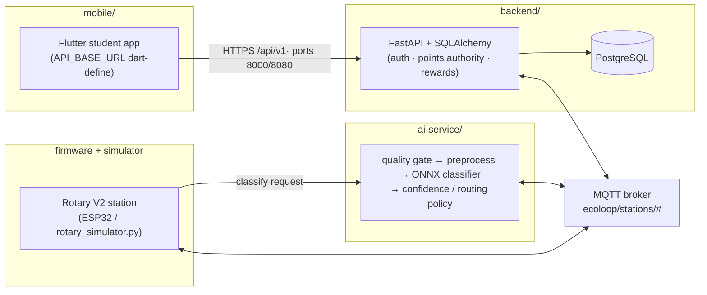
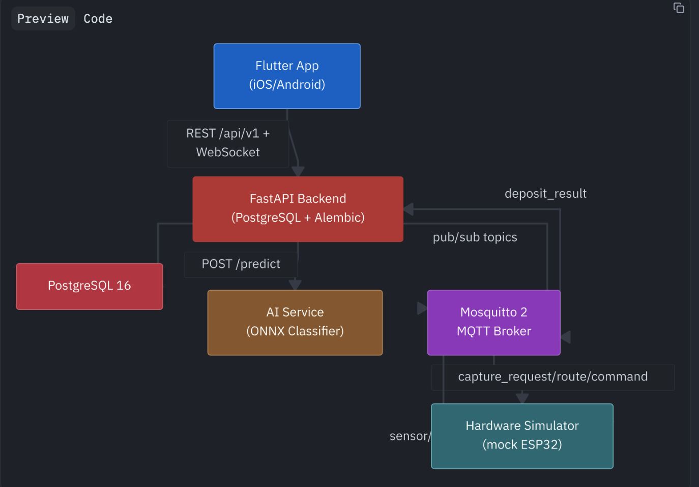
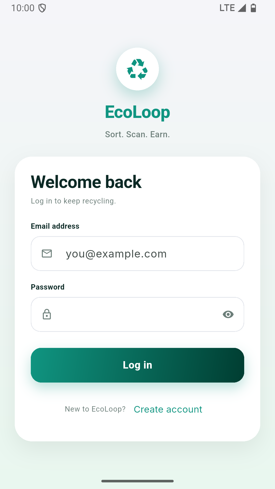
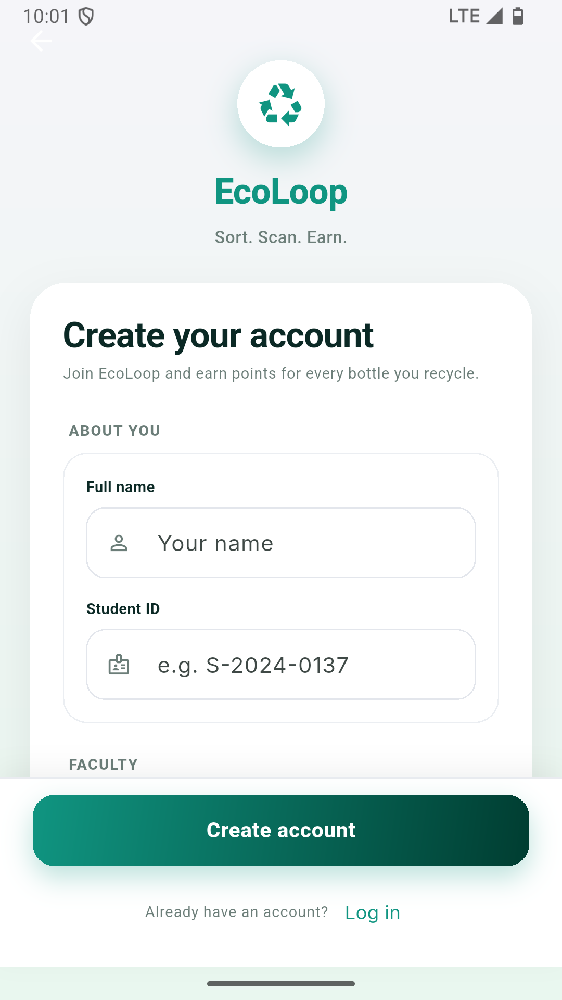
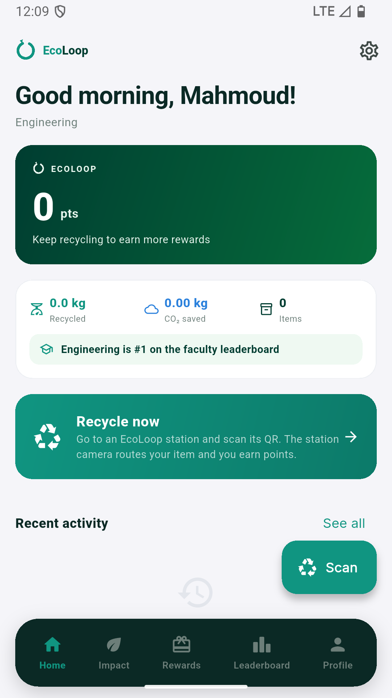
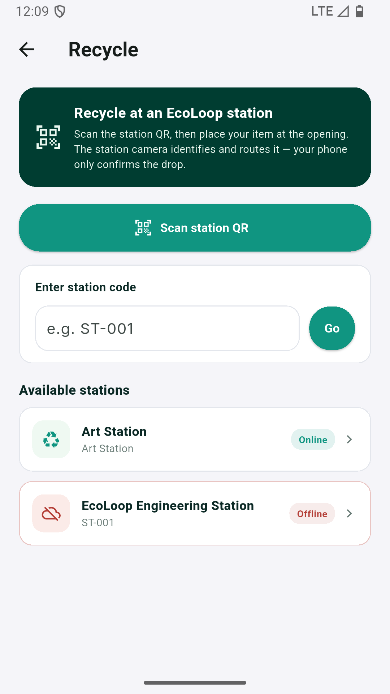
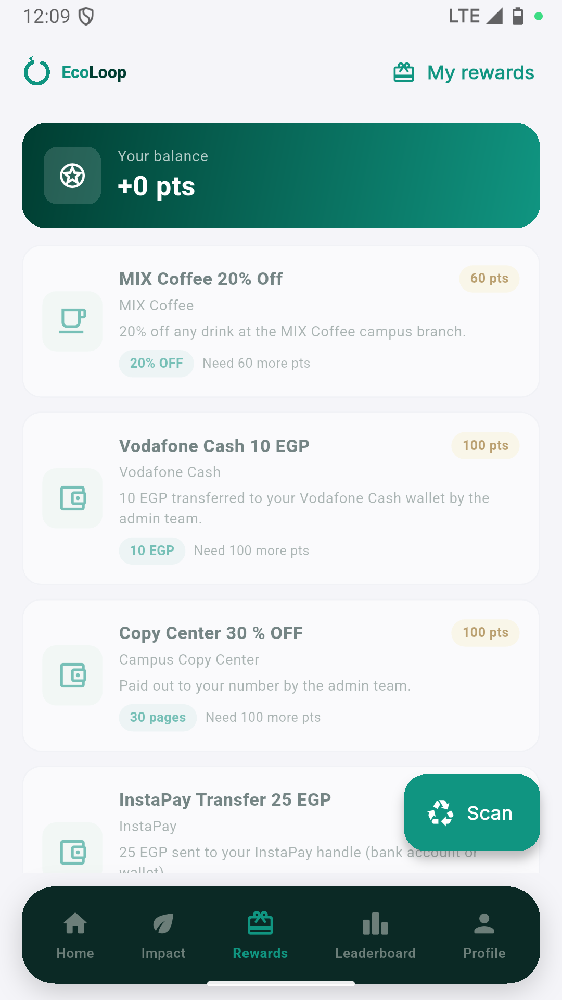
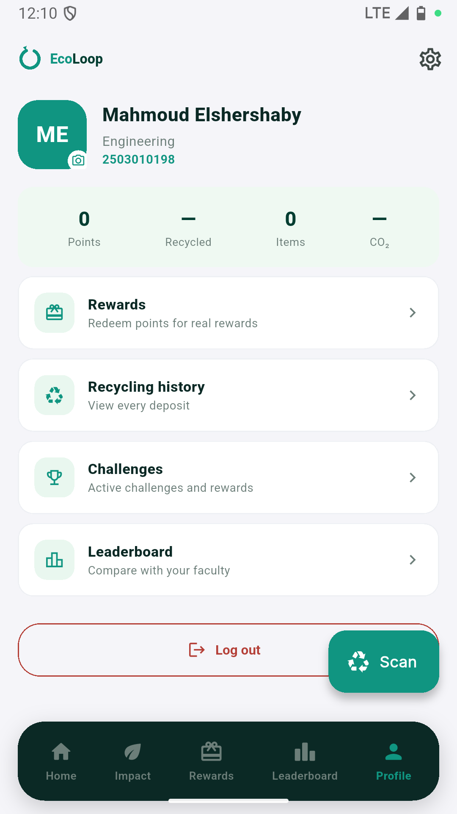
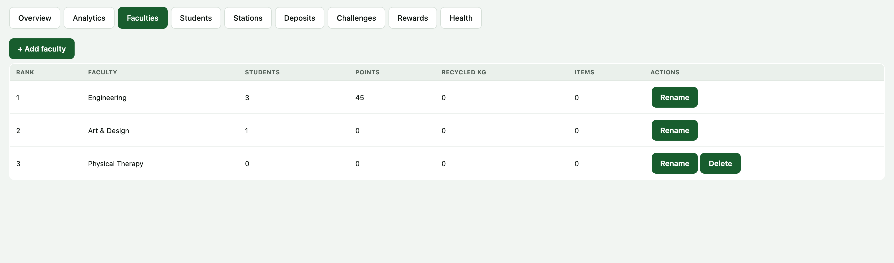

# EcoLoop

**EcoLoop — automated campus waste sorting powered by the Rotary
Sorting Mechanism V2.**

A standalone product: a rotary-chute sorting station, its ESP32 firmware,
an AI classification pipeline, a FastAPI/PostgreSQL backend, an MQTT station
network, simulators, tests and end-to-end proofs — everything needed to run
and demonstrate EcoLoop on its own.



## Key features

- **Rotary Sorting Mechanism V2** — four fixed bins, one rotating chute that
  aligns its outlet with the routed bin via a stepper, Hall-sensor home
  reference, and load-cell + IR deposit verification.
- **AI classification** — quality gate → preprocessing → ONNX model →
  confidence-based routing policy (CPU inference, no GPU required).
- **Points authority** — balances, deposits and rewards are computed
  exclusively by the backend; the client never grants itself points.
- **Real MQTT station network** — authenticated broker, real station
  simulator, documented contract (`docs/mqtt-contract.md`).
- **End-to-end proofs** — `scripts/e2e_rotary_chain.py` exercises the whole
  chain on real services.

## The Rotary Sorting Mechanism V2

Four fixed bins; the moving element is a **rotating chute** that aligns its
outlet with the routed bin:

```
ROUTE_TO compartment → look up target angle (calibration table)
→ rotate stepper shortest path → Hall-sensor home reference
→ position confirmed → gravity release → load cell + IR verification
→ deposit_result (mechanism_position) → backend awards points
```

Engineering notes, geometry, torque budget, wiring, BOM, calibration and
recovery procedures: `docs/rotary-v2.md`.

## Tech stack

| Layer | Tech |
|---|---|
| Backend | FastAPI · SQLAlchemy · Alembic · PostgreSQL · paho-mqtt |
| AI service | FastAPI · ONNX Runtime · NumPy · SciPy · scikit-learn |
| Firmware | PlatformIO / ESP32 (`pio run -d firmware/rotary-v2`) |
| Mobile | Flutter (`mobile/ecoloop`) |
| Infra | docker-compose · authenticated Mosquitto broker |

## Layout

| Path | What |
|---|---|
| `backend/` | FastAPI + SQLAlchemy + Alembic API (auth, deposits, points authority, rewards, leaderboard) |
| `ai-service/` | quality gate → preprocessing → ONNX classifier → confidence/routing policy |
| `hardware-simulator/` | MQTT-accurate Rotary V2 station simulator (`rotary_simulator.py`) |
| `firmware/rotary-v2/` | ESP32 firmware for the rotary station |
| `mobile/` | Flutter student app (`ecoloop` package) |
| `shared/` | Dart wire models for the mobile app |
| `scripts/` | `e2e_rotary_chain.py` (Rotary live proof), `dev_up.sh` / `dev_health.sh` (real dev stack) |
| `infra/` | docker-compose + authenticated mosquitto config |
| `docs/` | architecture, API contract, MQTT contract, mechanism abstraction |

## Run

```bash
# development broker + services (see docs/architecture.md)
scripts/dev_up.sh                       # Postgres + broker + AI + backend (real stack)
scripts/dev_health.sh                   # verify every service honestly
python scripts/e2e_rotary_chain.py     # full-chain Rotary proof on real services
pytest backend/tests ai-service/tests hardware-simulator/tests
pio run -d firmware/rotary-v2          # compiles clean for esp32dev
```

## Modes

- **Production**: the app always talks to THIS repository's backend — no demo
  mode, no offline fallback, balances come exclusively from the backend.

```bash
cd mobile && flutter run \
  --dart-define=API_BASE_URL=http://10.0.2.2:8080/api/v1
```

Ports/services are owned by this project (API 8000/8080 · AI 8051 · MQTT
1883/1884) and are configured exclusively via this repository's environment.

## Screenshots

Flutter student app and the admin console:

| | |
|---|---|
|  |  |
|  |  |
|  |  |
|  |  |

Run the app: `cd mobile/ecoloop && flutter run`.

## Status & Known Limitations

- **Standalone product**: EcoLoop runs with no dependency on any other
  project's source or services.
- **Firmware**: `firmware/rotary-v2` compiles clean for `esp32dev` and
  implements the mechanism contract, but the physical station has not been
  field-deployed yet; calibration torque/geometry data lives in
  `docs/rotary-v2.md`.
- **ML weights**: the runtime ONNX model is **not committed** to the
  repository (large binary, see `ai-service/models/.gitignore`). Generate or
  restore it before production inference.
- **Training deps**: `ai-service` imports the training module at startup
  (`app/tools` → `training/train.py`), so serving also needs
  `requirements-training.txt` (torch) installed — not just `onnxruntime`.
- **pandas pin**: the ML stack uses `freq='H'` resampling, which breaks on
  pandas ≥ 3.0 — keep pandas pinned to ≤ 2.x.
- Tests are green on a clean virtualenv: backend **200**, ai-service **87**,
  hardware-simulator **35**.